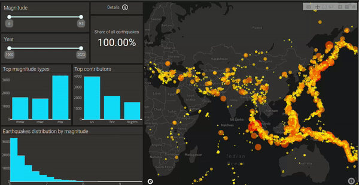

# Earthquake Data Visualization Dashboard
### Check out the [webapp](https://earthquake-data-visualization-6422c5c4d5d0.herokuapp.com/)!

This webapp allows you to observe and delve into more than 8000+ significant earthquakes (with a magnitude of 6 or higher) recorded from January 1st, 1960, until July 16th, 2023. Among the notable earthquakes you can find here are 2011 Tohoku Earthquake, Japan and the 1960 Great Valvidia Earthquake, Chile. 



## Run on your Linux machine

  - Firstly, you need to fork the repository from the upper-right corner of the page.
  - Next,  open the terminal and enter the following commands:


```bash
cd <your_desired_directory_path>
```
clone the repo with URL to Git repo (e.g. https://github.com/AdiletBaimyrza/data_visualization.git )
```bash
git clone <URL_to_git_repo> 
```
once finished cd to the project folder
```bash
cd data_visualization
```
if you have virtualenv installed, then create a new virtual environment with the following command, if not, well, install it first:)
```bash
python3 -m virtualenv .venv
```
activate the virtual environment
```bash
source .venv/bin/activate 
```
then, install all requirements from requirements.txt file.
Upgrade pip if you need to.
```bash
pip install -r requirements.txt
```
It will take a while depending on your internet connection

now run the app.py file either with a relative path

```bash
python3 data_visualization/app.py
```
or cd first to app directory data_visualization and then run
```bash
python3 app.py
```
Lastly copy the address from the terminal and paste it to your
favourite browser. Goodluck!
